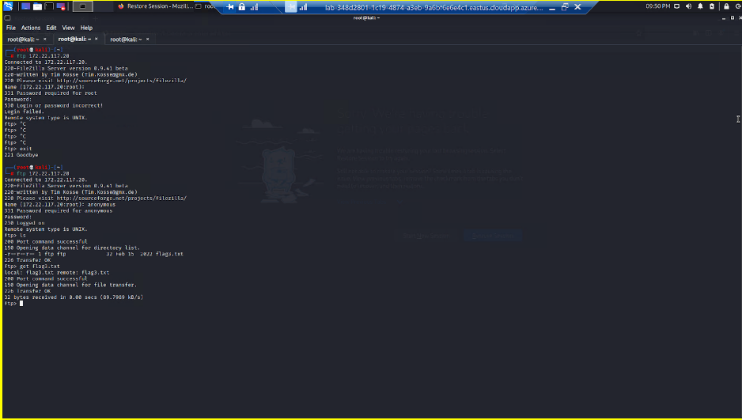
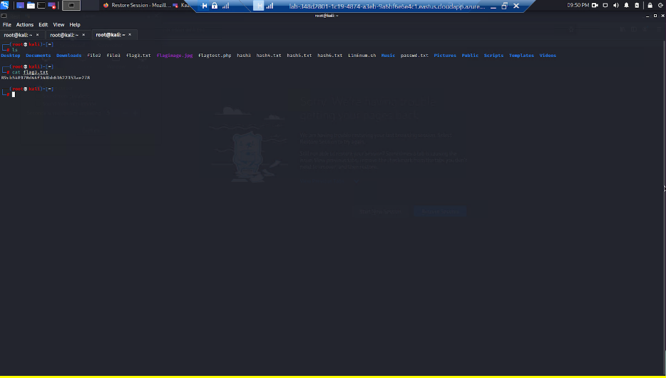
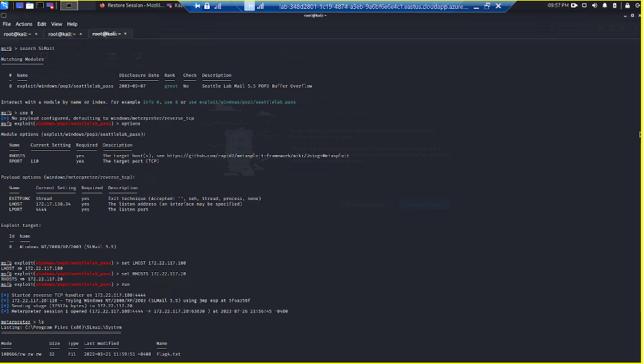
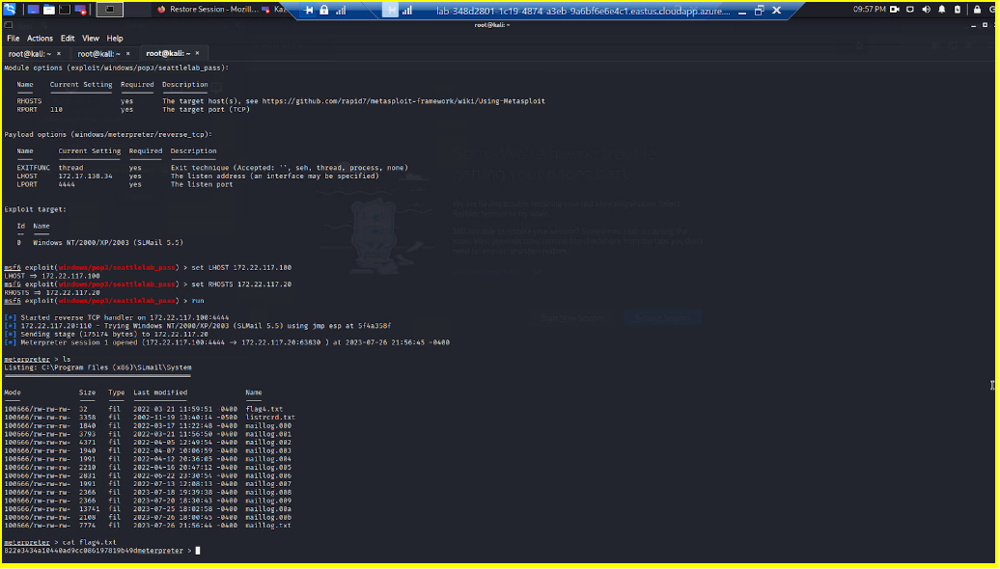
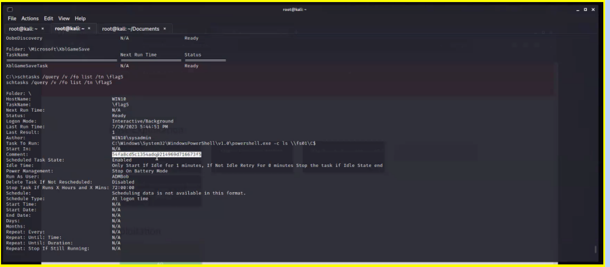
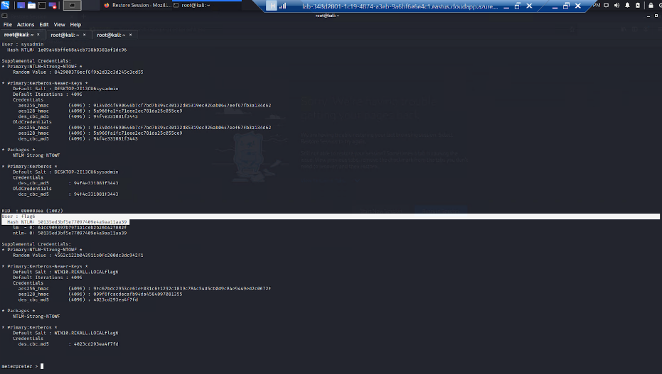
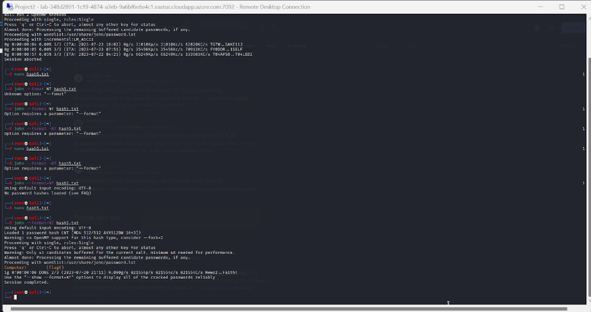

# Capture_The_Flag_Offensive_Security
Date: Jul 2023

## Overview of the Offensive Security Project
Participated in a rigorous Capture the Flag (CTF) exercise of a fictive company Rekall Corporation (totalrekall.xyz), utilizing advanced offensive security techniques to uncover and exploit vulnerabilities within a simulated organization environment

## Key Achievements
- Detected and acted upon security flaws in the organization's web application, securing competition flags as proof of successful penetration
- Demonstrated proficiency in endpoint security by launching a targeted attack on Rekall's Linux servers, tapping into Linux-specific vulnerabilities to access critical data and capture competition flags
- Pivoted strategies to target Rekall’s Windows servers, employing in-depth knowledge of Windows OS vulnerabilities to infiltrate the system and seize additional flags

## Technologies used
-Kali Linux
-Nessus
-Windows Operating System
-Linux Operating System

## Screenshots
I) Web Application vulnerabilities

1) -XSS payload

2) -Php script uploaded to get the flag 

3) -Robot exclusion protocol (robots.txt)

II) Linux Server vulnerabilities

1) -SSL certificate, use of "crt.sh" and look up for totalrekall.xyz for the flag.

2) -Nmap agressive scan on every IP address on the domain totalrekall.xyz with an IP address of 192.168.13.0/24 as the flag is the IP address running the Drupal service. The flag was the following IP address 192.168.13.13

3) -Use of Metasploit to find an exploit on the Linux server and navigate to the root folder within the shell to get the flag.

4) -Nessus indicated to use a Struts exploit for the next IP address targeted, therefore, I tried a couple of them and found out that it was the multi/http/struts2_content_type_ognl exploit, it opened a meterpreter shell and the flag was within the root folder.

5) -For the next flag, after running an aggressive nmap scan, it is mentioned that it uses Drupal CVE 2019-6340. Therefore, after trying a couple of Drupal exploits, the one that was working was unix/webapp/drupal_restws_unserialize. Once the meterpreter session got opened, I simply used a getuid command to get the username of the user as the username was the actual flag.

6) -Finally the last flag of the linux server, in order to get the flag we had to review information from a tool called "ICANN lookup" with the full url of the company and it mentioned that the user was alice so we simply used the command ssh alice@192.168.13.14 with the password alice to get access to the machine. After that, in order to escalate our privilege, the hint provided the information CVE-2019-14287 where the vulnerability there was to use the following command: sudo -u#-1 /bin/bash in order to escalate our privilege to root. After that, we simply cd into root and got the flag

III) Windows Server vulnerabilities

1) The first flag for the Windows server is within a GitHub repositories belonging to totalrekall. Within the repository, there was a file with a username followed by a hash which I cracked using John the Ripper

2) -For the next flag, after running an aggressive scan, the IP address corresponding to the ftp was 172.22.117.20. After that, we ran ftp 172.22.117.20 and connected with anonymous credentials. The flag was there, we simply used a get flag3.txt command to transfer the file within our kali linux terminal and open it.

3) -As for the following flag, the indication mentioned to find a machine that is running SLMail and it was the one with the IP address 172.22.117.20. After that, we opened metasploit and searched for SLMail as there was only one exploit named exploit/windows/pop3/seattlelab_pass. After entering the meterpreter session, we only had to use “ls” and cat the flag4.txt

4) -For flag 5, after we got access to the machine, we were able to check the schedule task where we found flag 5.

5) -Flag 6 was located in the same machine, I found an NTLM hash while loading kiwi and doing lsa_dump_sam, I then cracked the hash using john and found flag 6.

