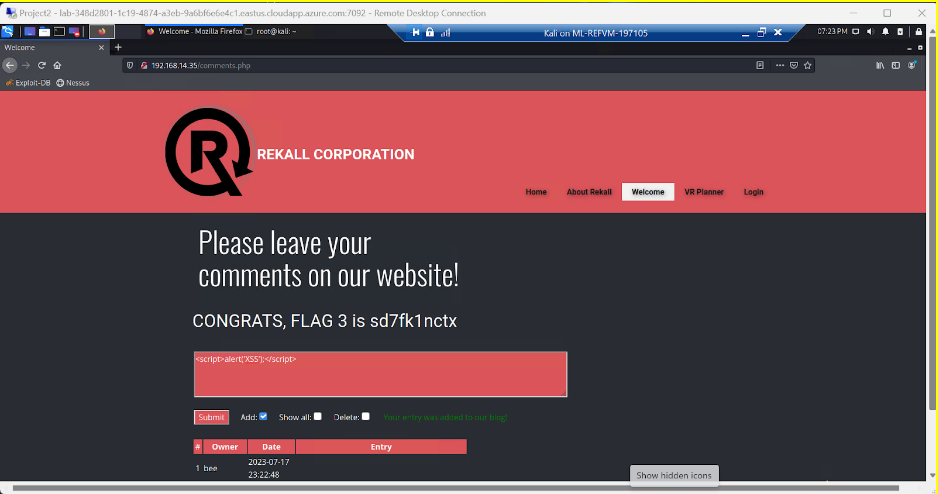

# Capture_The_Flag_Offensive_Security
Date: Jul 2023

## Overview of the Offensive Security Project
Participated in a rigorous Capture the Flag (CTF) exercise of a fictive company Rekall Corporation (totalrekall.xyz), utilizing advanced offensive security techniques to uncover and exploit vulnerabilities within a simulated organization environment

## Key Achievements
- Detected and acted upon security flaws in the organization's web application, securing competition flags as proof of successful penetration
- Demonstrated proficiency in endpoint security by launching a targeted attack on Rekall's Linux servers, tapping into Linux-specific vulnerabilities to access critical data and capture competition flags
- Pivoted strategies to target Rekall’s Windows servers, employing in-depth knowledge of Windows OS vulnerabilities to infiltrate the system and seize additional flags

## Technologies used
-Kali Linux
-Nessus
-Windows Operating System
-Linux Operating System

## Screenshots
I) Web Application vulnerabilities

1) -XSS payload

2) -Php script uploaded to get the flag 

3) -Robot exclusion protocol (robots.txt)

II) Linux Server vulnerabilities

1) -SSL certificate, use of "crt.sh" and look up for totalrekall.xyz for the flag.

2) -Nmap agressive scan on every IP address on the domain totalrekall.xyz with an IP address of 192.168.13.0/24 as the flag is the IP address running the Drupal service. The flag was the following IP address 192.168.13.13

3) -Use of Metasploit to find an exploit on the Linux server and navigate to the root folder within the shell to get the flag.

4) -Nessus indicated to use a Struts exploit for the next IP address targeted, therefore, I tried a couple of them and found out that it was the multi/http/struts2_content_type_ognl exploit, it opened a meterpreter shell and the flag was within the root folder.

5) -For the next flag, after running an aggressive nmap scan, it is mentioned that it uses Drupal CVE 2019-6340. Therefore, after trying a couple of Drupal exploits, the one that was working was unix/webapp/drupal_restws_unserialize. Once the meterpreter session got opened, I simply used a getuid command to get the username of the user as the username was the actual flag.

III) Windows Server vulnerabilities
